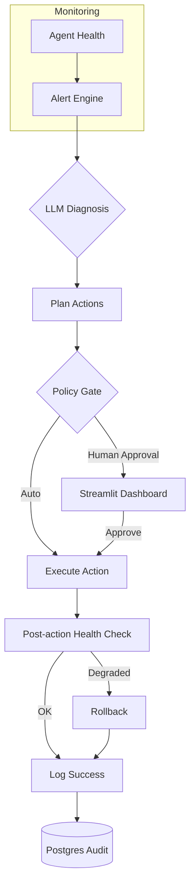

# aiopsx — AI Deployment & Monitoring Toolkit

[](LICENSE)
[](https://www.python.org)
[](docker-compose.yml)
[](https://github.com/GBOYEE/aiopsx/actions)
[](https://codecov.io/gh/GBOYEE/aiopsx)

**Keep your AI agents healthy and auditable.** aiopsx provides a complete operations toolkit for deploying, monitoring, and governing AI agent services in production — with automatic rollback, human-in-the-loop approval gates, and immutable audit logs.

<p align="center">
  
</p>

## ✨ Features

- 🔍 **Health Monitoring** — Continuous `/health` checks and Prometheus metrics scraping
- 🤖 **LLM-Powered Diagnosis** — AI analyzes anomalies and suggests remediation
- 🛡️ **Policy Gates** — Define which actions are auto-approved vs human-approved
- 🔄 **Automatic Rollback** — If health degrades after an action, automatically revert
- 📜 **Audit Trail** — Every decision, approval, and action logged to PostgreSQL
- 🖥️ **Streamlit Dashboard** — Human-in-the-loop approval UI, metrics charts, logs
- 🐳 **Docker Compose Ready** — One-command deploy with all services

## 🚀 Quick Start

```bash
git clone https://github.com/GBOYEE/aiopsx.git
cd aiopsx
cp .env.example .env
docker compose up -d
```

Open dashboard: http://localhost:8501  
Control plane: http://localhost:8000/docs (API docs)

## 🏗️ Architecture



See [docs/architecture.md](docs/architecture.md) for detailed explanation.

## 📦 Tech Stack

| Component | Technology |
|-----------|------------|
| Control Plane | FastAPI, asyncio |
| Dashboard | Streamlit |
| Database | PostgreSQL (state + audit) |
| Cache/Bus | Redis |
| LLM | OpenAI / Ollama (pluggable) |
| Monitoring | Prometheus metrics |
| Deployment | Docker Compose |

## 🧪 Testing & CI

```bash
pytest tests/ -v --cov=app --cov-report=html
```

CI runs on every push: lint (ruff), type-check (mypy), tests, coverage.

## 📚 Documentation

- [Getting Started](docs/README.md)
- [API Reference](docs/api.md)
- [Configuration](docs/configuration.md)
- [Contributing](CONTRIBUTING.md)

## 🎯 Roadmap

- [ ] Multi-tenant SaaS mode
- [ ] OAuth2 integrations (GitHub, Google)
- [ ] Advanced RBAC with resource-level permissions
- [ ] Audit log UI with filtering and export
- [ ] Grafana dashboard packs
- [ ] Webhook notifications (Slack, Teams)

## 🤝 Contributing

We welcome contributions! Please read [CONTRIBUTING.md](CONTRIBUTING.md) before opening issues or PRs.

**Good first issues:** documentation, UI polish, additional metric collectors.

## 📄 License

MIT — see [LICENSE](LICENSE).

---

<p align="center">
Built by <a href="https://github.com/GBOYEE">Oyebanji Adegboyega</a> • 
<a href="https://gboyee.github.io">Portfolio</a> • 
<a href="https://twitter.com/Gboyee_0">@Gboyee_0</a>
</p>