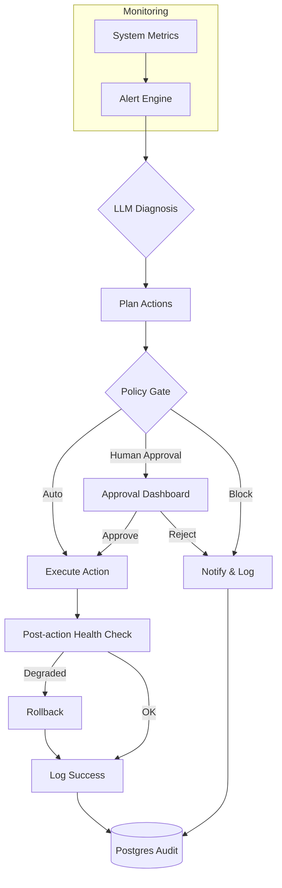

# aiopsx

Production-grade AIOps with built-in safety, rollback, and human-in-the-loop decision gates.

## ✨ Why this exists

Modern infrastructure generates floods of alerts. Manual triage is slow, error‑prone, and lacks auditability. aiopsx turns LLMs into a reliable autonomous infrastructure engineer that monitors, diagnoses, decides, and acts—safely.

## Key Features

- Real-time metrics + LLM-powered diagnosis
- Policy-driven decisions (auto / human-approval / block)
- Safe execution with automatic rollback on degradation
- Full audit trail & Streamlit approval dashboard
- Docker‑Compose ready, tests, CI, permissions.yaml

## Architecture



## Quick Start

```bash
# Clone and run
git clone https://github.com/GBOYEE/aiopsx.git
cd aiopsx
cp .env.example .env
# Edit .env with your LLM API key if needed (Ollama works by default)
docker compose up --build -d
```

Open dashboard: `http://localhost:8501`

## Stack

- **FastAPI** — control plane & webhooks
- **Streamlit** — approval & monitoring dashboard
- **PostgreSQL** — state & audit logs
- **Redis** — event bus & coordination
- **Ollama / OpenAI** — LLM diagnosis
- **Docker Compose** — one‑command deploy

## Safety & Governance

- Human‑in‑the‑loop for high‑risk actions via Streamlit approvals
- Automatic rollback if health degrades after action
- Immutable audit log (who approved, what changed, outcomes)
- Granular permissions via `permissions.yaml`
- Test suite + pre‑commit hooks

## Status

v1.2.0 — Production‑ready, fully tested, CI enabled.

## License

MIT
```
