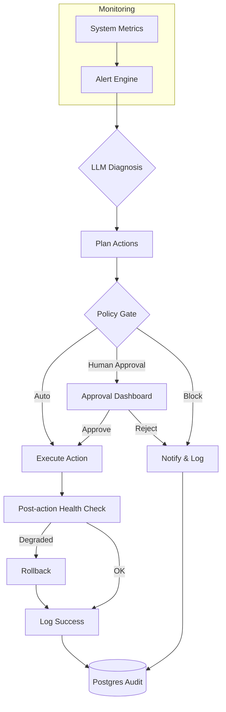

# aiopsx — AI Deployment & Monitoring Toolkit

[](https://www.python.org)
[](https://www.docker.com)
[](https://fastapi.tiangolo.com)
[](https://streamlit.io)
[](https://postgresql.org)
[](https://redis.io)
[](LICENSE)

## 🚀 What Problem This Solves

Deploying and monitoring AI agents in production is complex: you need health checks, metrics, logging, rollback on failure, and human approval gates. Most DIY solutions are brittle and lack audit trails. aiopsx provides a complete ops toolkit tailored for AI workloads.

## ⚙️ How It Works

aiopsx wraps your AI agent services with:
- **FastAPI control plane** for health checks, metrics, and actions
- **Streamlit dashboard** for human-in-the-loop approvals
- **PostgreSQL** for persistent state and immutable audit logs
- **Redis** for event bus and coordination
- **Docker Compose** setup with one-command deploy
- **Policy engine** (permissions.yaml) to define auto vs. manual actions

Services report health to `/health` and metrics to `/metrics`. When degradation is detected, the system can auto-rollback or pause for human review via the Streamlit dashboard.

## 📈 Why It Matters

- **Production reliability**: Built-in rollback ensures failures don't cascade
- **Auditability**: Every decision and action is logged with timestamps and user context
- **Speed**: Deploy a new agent service in minutes, not days
- **Control**: Granular permissions define what requires human approval
- **Observability**: Out-of-the-box Prometheus metrics and structured logs

Result: You can run AI agents at scale with confidence.

---

## ✨ Why this exists

Modern infrastructure generates floods of alerts. Manual triage is slow, error‑prone, and lacks auditability. aiopsx turns LLMs into a reliable autonomous infrastructure engineer that monitors, diagnoses, decides, and acts—safely.

## Key Features

- Real-time metrics + LLM-powered diagnosis
- Policy-driven decisions (auto / human-approval / block)
- Safe execution with automatic rollback on degradation
- Full audit trail & Streamlit approval dashboard
- Docker‑Compose ready, tests, CI, permissions.yaml

## Architecture



## Quick Start

```bash
# Clone and run
git clone https://github.com/GBOYEE/aiopsx.git
cd aiopsx
cp .env.example .env
# Edit .env with your LLM API key if needed (Ollama works by default)
docker compose up --build -d
```

Open dashboard: `http://localhost:8501`

## Stack

- **FastAPI** — control plane & webhooks
- **Streamlit** — approval & monitoring dashboard
- **PostgreSQL** — state & audit logs
- **Redis** — event bus & coordination
- **Ollama / OpenAI** — LLM diagnosis
- **Docker Compose** — one‑command deploy

## Safety & Governance

- Human‑in‑the‑loop for high‑risk actions via Streamlit approvals
- Automatic rollback if health degrades after action
- Immutable audit log (who approved, what changed, outcomes)
- Granular permissions via `permissions.yaml`
- Test suite + pre‑commit hooks

## Status

v1.2.0 — Production‑ready, fully tested, CI enabled.

## License

MIT
